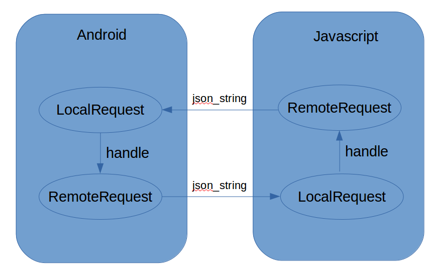
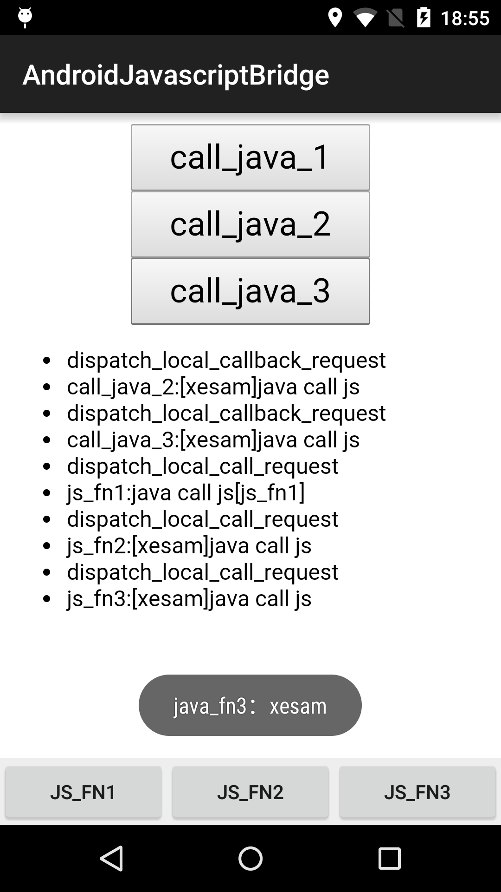

#AndroidJavascriptBridge

Java 与 Js 互调封装 [AndroidJavascriptBridge](https://github.com/xesam/AndroidJavascriptBridge)

#JS 调用 Java
##Js 简单调用

这个比较常见，适用于同步，没有回调的情况

示例：

java ：

    @JavascriptInterface
    public void java_fn() {
    }

    webView.addJavascriptInterface(this, "Java");

js：

    Java.java_fn();

##Js 回调
两种形式

    js.call({
        data : {},
        fn:function(){}
    })

    js.call(data, function(){
    })

主要问题 ：

1. 普通对象无法无法直接传递
2. 回调函数无法传递

所以，一种处理方式就是在 js 上下文种保持整个请求，在 java 执行完毕之后，从 java 去主动调用 js 方法，找到原始的请求，并执行正确的回调。
示意图如下：

如此可以嵌套调用下去。一个完整的封装实现：[AndroidJavascriptBridge](https://github.com/xesam/AndroidJavascriptBridge)

###使用示例

java:

    final JavascriptBridge javascriptBridge = new JavascriptBridge(webView);
    javascriptBridge.registerLocalRequestHandler("java_fn1", new LocalCallRequest.RequestHandler() {
        @Override
        public void handle(LocalCallRequest localCallRequest, Person data) {
            Gson gson = new Gson();
            Person data = gson.fromJson(requestString, Person.class);
            Toast.makeText(getApplicationContext(), data.name, Toast.LENGTH_SHORT).show();
            if (localCallRequest.hasCallback()) {
                javascriptBridge.deliveryRemoteCallback(localCallRequest, "succ", new Person().getJSONObject());
            }
        }
    });

js:

    document.getElementById('call_java_2').addEventListener('click', function () {
        bridge.invoke_remote_call('java_fn2',
            {
                succ: function (resp) {
                    log("call_java_2:" + resp.name);
                }
            },
            true);
    }, false);

#Java 调用 Js

##Java 简单调用

KitKat 之后可以使用 evaluateJavascript。其他择可以使用传统的 WebView.loadUrl

    if (Build.VERSION.SDK_INT >= Build.VERSION_CODES.KITKAT) {
        mWebView.evaluateJavascript(script, new ValueCallback<String>() {
            @Override
            public void onReceiveValue(String value) {

            }
        });
    } else {
        mWebView.loadUrl("javascript:" + script);
    }

##Java 回调

见上图

###使用示例

js:

    bridge.register_local_request_handler('js_fn1', function (data, callback_id) {
        log("js_fn1:java call js[js_fn1]");
    });

java:

    findViewById(R.id.js_fn1).setOnClickListener(new View.OnClickListener() {
        @Override
        public void onClick(View v) {
            RemoteCallRequest remoteCallRequest = new RemoteCallRequest("js_fn1", new Person().getJSONObject());
            javascriptBridge.invokeRemoteCall(remoteCallRequest);

        }
    });

##效果图

##Android分享 Q群：315658668

